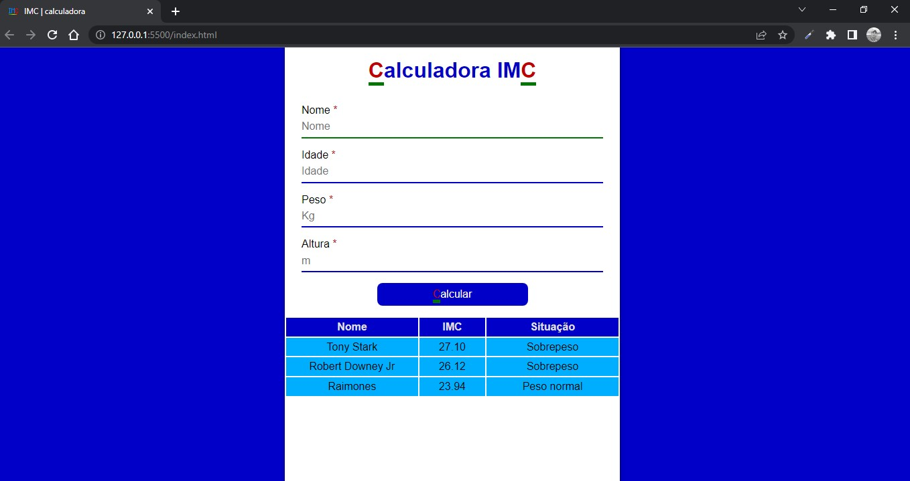
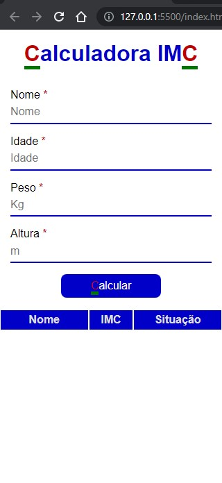

<h1> Calculadora de IMC</h1> 

## 🔢 Calculadora de Índice de Massa Corporal

### Aplicação dinâmica, para fins de prática de conhecimentos e aperfeiçoamento de técnicas.

----
----

## 🛠 Recursos:
- ### Página inicial

Entrada de dados;

Botão calcular;

Cabeçalho de tabela de resultados.

- ### Página final

Tabela de resultados;

Retorno do cálculo de acordo aos dados inseridos;

Identificação por nome de entrada;

Resultado do cálculo de IMC;

Informativo de situção considerando a classificação de IMC.

----

## 📲 Responsividade

----

## 💻 Tecnologias utilizadas

  

----

## ✒️ Design
- ### Simples, minimalista, monocromático, bordas retas e tema light.

----

## ⬆️ Atualizar

- Incluir persistência de dados;
- Permitir exclusão de linhas da tabela;
- Permitir limpesa da tabela;

----

## 📖 Abordagens

- POO, MVC, convenções, e abordagens de segurança;

----

<a href="https://raimonesbarros.github.io/Calculadora-de-IMC/"><button style='padding:.5em; background-color:skyblue; border-radius:.5em; font-weight:bold'> 📤 Acessar Deploy 📤 </button> </a>

----
----